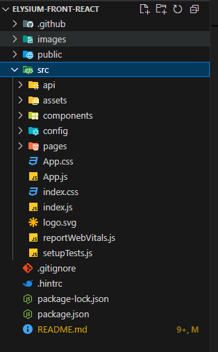

# Elysium-Front: Sistema de Reserva de Laboratorios 🏫


Elysium-Front es la interfaz de usuario para el sistema de gestión de reservas de laboratorios de la Decanatura de Ingeniería de Sistemas de la Escuela Colombiana de Ingeniería Julio Garavito. Esta aplicación React permite a los usuarios visualizar la disponibilidad de laboratorios, realizar reservas, gestionar recursos y analizar datos de uso mediante visualizaciones interactivas.

## Tabla de Contenidos 📋

- [Integrantes](#integrantes)
- [Caso de Negocio](#caso-de-negocio)
- [Tecnologías Utilizadas](#tecnologías-utilizadas-)
- [Node.js y Módulos](#nodejs-y-módulos-)
- [Arquitectura](#arquitectura-)
- [Integración con Backend](#integración-con-backend-)
- [Visualizaciones con D3.js](#visualizaciones-con-d3js-)
- [CI/CD con Azure](#cicd-con-azure-)
- [Configuración del Proyecto](#configuración-del-proyecto-)
- [Estructura del Proyecto](#estructura-del-proyecto-)
- [Contribuciones](#contribuciones-)

## Integrantes

- Andersson David Sánchez Méndez
- Cristian Santiago Pedraza Rodríguez
- Ricardo Andres Ayala Garzon
- Santiago Botero García

## Caso de Negocio

El proyecto consiste en una aplicación para la gestión de reservas de laboratorios dentro de la Decanatura de Ingeniería de Sistemas de la Escuela Colombiana de Ingeniería Julio Garavito. Los usuarios pueden consultar la disponibilidad de laboratorios, realizar reservas y cancelar sus reservas desde una interfaz web amigable e intuitiva.

Este frontend trabaja en conjunto con el backend desarrollado en Spring Boot (Elysium-Back), expandiendo la funcionalidad presentada en el Sprint 3 del proyecto backend, pero enfocándose específicamente en la experiencia de usuario y la presentación de datos.

## Tecnologías Utilizadas 🛠️

- **React**: Biblioteca principal para la construcción de la interfaz de usuario
- **CSS**: Estilos personalizados para la interfaz de usuario
- **Axios**: Cliente HTTP para realizar peticiones a la API REST
- **React Router DOM**: Navegación entre componentes
- **D3.js**: Biblioteca para crear visualizaciones de datos interactivas
- **JWT Decode**: Decodificación de tokens JWT para autenticación
- **Date-fns**: Manipulación de fechas en JavaScript
- **React DatePicker**: Componente para selección de fechas
- **Framer Motion**: Animaciones para mejorar la experiencia de usuario
- **GitHub Actions**: Configuración de CI/CD
- **Azure Static Web Apps**: Alojamiento de la aplicación

## Node.js y Módulos 📦

La aplicación está construida sobre Node.js, que es un requisito para ejecutar cualquier proyecto React. A continuación se detallan los principales módulos npm utilizados y su propósito en la aplicación:

### Módulos Principales

```json
{
  "dependencies": {
    "axios": "^1.8.4",            // Cliente HTTP para comunicación con API
    "d3": "^7.9.0",               // Visualizaciones de datos
    "date-fns": "^4.1.0",         // Utilidades para manejo de fechas
    "framer-motion": "^12.6.2",   // Animaciones y transiciones UI
    "jwt-decode": "^4.0.0",       // Decodificación de tokens JWT
    "react": "^19.0.0",           // Biblioteca principal React
    "react-datepicker": "^8.2.1", // Selector de fechas
    "react-day-picker": "^9.6.4", // Alternativa para selección de fechas
    "react-dom": "^19.0.0",       // Renderización de React en el DOM
    "react-router-dom": "^7.4.1", // Navegación entre componentes
    "react-scripts": "^5.0.1"     // Scripts de configuración y build
  }
}
```

### Instalación de Módulos

Para instalar todas las dependencias necesarias, ejecute el siguiente comando en la raíz del proyecto:

```bash
npm install
```

## Arquitectura 🏗️

El frontend sigue una arquitectura moderna de React con una clara separación de responsabilidades:



### Estructura de Componentes

La aplicación se organiza siguiendo el patrón de componentes con las siguientes capas:

- **Componentes UI**: Elementos de interfaz reutilizables y sin estado
- **Contenedores**: Componentes con lógica de negocio y gestión de estado
- **Contextos**: Gestión del estado global usando React Context API
- **Servicios**: Encapsulación de la lógica de comunicación con API
- **Hooks**: Lógica reutilizable y gestión de efectos secundarios

### Patrón de Componentes

```jsx
// Ejemplo de componente reutilizable
const Button = ({ children, onClick, variant = 'primary' }) => {
  return (
    <button 
      className={`elysium-button elysium-button--${variant}`}
      onClick={onClick}
    >
      {children}
    </button>
  );
};
```

### Patrón Contenedor/Presentacional

Separación clara entre componentes de presentación (UI pura) y contenedores (con lógica de negocio):

```jsx
import React, {useEffect, useState} from "react";
import "./CRUDSalonModal.css";
import CRUDSalonForm from "./CRUDSalonForm"; 

function AddSalonModal({ onClose, newSalon, setNewSalon, recursosDisponibles, handleAddSalon }) {
  return (
    <div className="popup-overlay">
      <div className="salon-modal">
        <div className="modal">
          <h2>Agregar Salón</h2>
          <CRUDSalonForm 
            newSalon={newSalon} 
            setNewSalon={setNewSalon} 
            recursosDisponibles={recursosDisponibles} 
          />
          <div className="modal-buttons">
            <button className="cancel-button" onClick={onClose}>Cancelar</button>
            <button className="save-button" onClick={handleAddSalon}>Agregar</button>
          </div>
        </div>
      </div>
    </div>
  );
}

export default AddSalonModal;

```

## Integración con Backend 🔌

La comunicación con el backend se maneja a través de servicios específicos que utilizan Axios para realizar peticiones HTTP:

```javascript
// App.js
import React, { useState, useEffect } from "react";
import {
  BrowserRouter as Router,
  Route,
  Routes,
  Link,
  useLocation,
  Navigate,
  useNavigate,
} from "react-router-dom";
import LoginPage from "./pages/Login/LoginPage";
import Home from "./pages/Home/Home";
import AdministratorHome from "./pages/Administrator/AdministratorHome";
import GestionarSalones from './pages/Salones/GestionarSalones';
import GestionarUsuarios from './pages/Admin/GestionarUsuarios';
import styled from "styled-components";
import { jwtDecode } from "jwt-decode";
import "./App.css";

const routesConfig = {
  admin: [
    { path: "/administrador", name: "Panel de Control", icon: <House className="svg" /> },
    { path: "/administrador/salones", name: "Gestión de Salones", icon: <Room className="svg" /> },
    { path: "/administrador/usuarios", name: "Gestión de Usuarios", icon: <UserIcon className="svg" /> },
  ],
  profe: [
    { path: "/home", name: "Gestión de Reservas", icon: <House className="svg" /> },
  ]
};

const Menu = ({ user }) => {
  if (!user) return null;
  const userRoutes = routesConfig[user.isAdmin ? "admin" : "profe"] || [];

  return (
    <ul className="menu">
      {userRoutes.map((item, index) => (
        <li className="item-menu" key={index}>
          <Link className="navBarBTN" to={item.path}>
            {item.icon}
            {item.name}
          </Link>
        </li>
      ))}
    </ul>
  );
};
```

### Manejo de Autenticación

Para la gestión de autenticación, se utiliza el Context API de React junto con tokens JWT:

```jsx
// Componente principal de rutas
//
function AppRoutes({ user, setUser }) {
  const [loading, setLoading] = useState(true);
  const navigate = useNavigate();

  useEffect(() => {
    const fetchUser = async () => {
      const token = localStorage.getItem("token");
      if (token) {
        try {
          const correoGuardado = obtenerCorreoDesdeToken(token);
          if (correoGuardado) {
            const usuario = await consultarUsuarioPorCorreo(correoGuardado);
            setUser(usuario);

            if (usuario.isAdmin) {
              document.documentElement.style.setProperty("--variable-collection-current-color", "var(--variable-collection-user-admin)");
              navigate("/administrador");
            } else {
              document.documentElement.style.setProperty("--variable-collection-current-color", "var(--variable-collection-user-estandar)");
              navigate("/home");
            }
          } else {
            localStorage.removeItem("token");
          }
        } catch (error) {
          console.error("Error obteniendo usuario:", error);
          localStorage.removeItem("token");
        }
      }
      setLoading(false);
    };

    fetchUser();
  }, []);

  const handleLogout = () => {
    localStorage.removeItem("token");
    setUser(null);
  };
```

## Visualizaciones con D3.js 📊

La aplicación incluye dashboards y visualizaciones interactivas implementadas con D3.js para analizar patrones de uso de laboratorios:

```jsx
import React, { useEffect, useRef } from "react";
import * as d3 from "d3";

const DemandaChart = ({ reservas }) => {
  const chartRef = useRef(null);

  useEffect(() => {
    const svg = d3.select(chartRef.current);
    svg.selectAll("*").remove(); // Limpia el SVG

    if (!reservas || reservas.length === 0) return;

    const width = 600;
    const height = 500;

    svg.attr("width", width).attr("height", height);

    // Agrupar reservas por salón
    const reservasPorSalon = d3.rollup(
      reservas,
      (v) => v.length,
      (d) => d.idSalon
    );
    // Convertir a arreglo de objetos
    const data = Array.from(reservasPorSalon, ([salon, count]) => ({
      salon,
      count,
    }));

    // Usamos d3.hierarchy para crear una estructura para el pack layout.
    const root = d3.hierarchy({ children: data }).sum((d) => d.count);

    // Configurar el pack layout
    const pack = d3.pack().size([width, height]).padding(10);

    const nodes = pack(root).leaves();

    // Escala de colores
    const color = d3.scaleOrdinal(d3.schemeSet3);

    // Dibujar las burbujas
    const node = svg
      .selectAll("g")
      .data(nodes)
      .enter()
      .append("g")
      .attr("transform", (d) => `translate(${d.x}, ${d.y})`);

    node
      .append("circle")
      .attr("r", 0)
      .attr("fill", (d, i) => color(i))
      .transition()
      .duration(800)
      .attr("r", (d) => d.r);

    // Agregar etiquetas dentro de cada burbuja (nombre del salón y cantidad)
    node
      .append("text")
      .attr("text-anchor", "middle")
      .attr("dy", "-0.3em")
      .attr("font-size", (d) => Math.min((2 * d.r) / d.data.salon.length, 18))
      .attr("fill", "#000")
      .text((d) => d.data.salon);

    node
      .append("text")
      .attr("text-anchor", "middle")
      .attr("dy", "1em")
      .attr("font-size", "12px")
      .attr("fill", "#000")
      .text((d) => d.data.count);
  }, [reservas]);

  return <svg ref={chartRef}></svg>;
};

export default DemandaChart;
```

## CI/CD con Azure 🚀

El proyecto implementa integración y despliegue continuo mediante GitHub Actions y Azure Static Web Apps. Esta configuración permite despliegue automático cuando se realizan cambios en la rama principal.

Se configuraron dos ambientes (prueba y producción) para el despliegue en Azure del Front.

Se hizo para establecer la conexión directa del front con el back mediante los ambientes correspondientes.


[AmbientePruebas](https://cicero-hfg6f7g3echkbvcf.canadacentral-01.azurewebsites.net/)
[AmbienteProducción](https://eros-g5bfdggfaffvevhr.canadacentral-01.azurewebsites.net)

### Configuración de GitHub Actions

```yaml
name: CI/CD Pipeline ELysium

on:
  push:
    branches:
      - main
  pull_request:
    branches:
      - develop
      - main

env:
  AZURE_WEBAPP_NAME: elysiumFrontEnd
  AZURE_WEBAPP_PACKAGE_PATH: '.'
  NODE_VERSION: '22.x'

jobs:
  build-and-deploy:
    runs-on: ubuntu-latest
    steps:
      - name: Checkout repository
        uses: actions/checkout@v4
        
      - uses: azure/login@v1
        with:
          creds: ${{ secrets.AZURE_CREDENTIALS }}

      - name: Cache Node.js modules
        uses: actions/cache@v3
        with:
          path: ~/.npm
          key: ${{ runner.os }}-node-${{ hashFiles('**/package-lock.json') }}
          restore-keys: |
            ${{ runner.os }}-node-

      - name: Setup Node.js
        uses: actions/setup-node@v4
        with:
          node-version: ${{ env.NODE_VERSION }}
          cache: 'npm'
          
      - name: Install dependencies
        run: npm install

      - name: Run tests
        run: npm run test --if-present

      - name: Build project
        run: npm run build --if-present

      - name: Deploy to Azure Web Apps
        uses: azure/webapps-deploy@v3
        with:
          app-name: ${{ env.AZURE_WEBAPP_NAME }}
          package: ./build

      - name: Logout from Azure
        run: az logout

```

## Configuración del Proyecto ⚙️

### Prerequisitos

- Node.js 16.x o superior
- npm 8.x o superior
- Git

### Variables de Entorno

Crear un archivo `.env` en la raíz del proyecto con las siguientes variables:

```
REACT_APP_API_URL=https://api.elysium.azurewebsites.net
REACT_APP_AUTH_DOMAIN=elysium-auth.azurewebsites.net
```

### Ejecutar el Proyecto Localmente

1. Clonar el repositorio:

```bash
git clone https://github.com/LePeanutButter/Elysium-Front-React.git
```

2. Navegar al directorio del proyecto:

```bash
cd Elysium-Front-React
```

3. Instalar dependencias:

```bash
npm install
```

4. Iniciar la aplicación:

```bash
npm start
```

La aplicación estará disponible en [http://localhost:3000](http://localhost:3000)

### Construir para Producción

Para generar una versión optimizada para producción:

```bash
npm run build
```

Los archivos de salida estarán en la carpeta `build/`.

## Estructura del Proyecto 📁

```
src/
├── assets/           # Recursos estáticos (imágenes, fuentes)
├── components/       # Componentes reutilizables
│   ├── common/       # Componentes UI base (Button, Input, etc.)
│   ├── layout/       # Componentes de estructura (Header, Footer, etc.)
│   ├── charts/       # Componentes de visualización con D3
│   └── forms/        # Componentes de formulario
├── containers/       # Componentes contenedores con lógica de negocio
├── context/          # Contextos para estado global (Auth, Theme, etc.)
├── hooks/            # Hooks personalizados
├── pages/            # Componentes de página completa
├── services/         # Servicios para comunicación con API
├── utils/            # Funciones de utilidad
├── App.js            # Componente principal
├── index.js          # Punto de entrada
└── routes.js         # Configuración de rutas
```

## Funcionamiento


## Contribuciones 🤝

Este proyecto sigue las prácticas de desarrollo colaborativo:

1. Los desarrolladores trabajan en ramas de características.
2. Se requieren Pull Requests para integrar código a la rama principal.
3. El código se implementa automáticamente después de la integración exitosa.

Para contribuir:

1. Crea un fork del proyecto
2. Crea una rama para tu característica (`git checkout -b feature/amazing-feature`)
3. Haz commit de tus cambios (`git commit -m 'Add some amazing feature'`)
4. Haz push a la rama (`git push origin feature/amazing-feature`)
5. Abre una Pull Request

---

Desarrollado con ❤️ por el equipo de Elysium